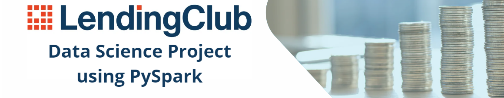

    

The Lending Club project aims to develop a predictive model based on historical loan repayment data to forecast whether an individual will fully repay their loan, default on the loan, or have a delayed payment. This project utilizes machine learning techniques to analyze patterns and factors that contribute to loan repayment behavior. **The project was created to showcase coding skills in PySpark, which is why the visual aspect has been kept to a minimum.**

## Introduction
In this data science project, I delve into the world of lending and finance by leveraging the extensive dataset provided by the Lending Club. Lending Club, as one of the most prominent peer-to-peer lending platforms, has amassed a vast repository of historical data regarding borrowers, their financial profiles, and the outcomes of their loan applications. This treasure trove of information presents us with a unique opportunity to harness the power of data science and machine learning to make informed credit risk assessments.

## Goal
My goal is to build a predictive model that can accurately predict whether an individual will repay a loan on time, make late payments, or default on it. The project's objective is to develop a classification model capable of classifying borrowers into these three categories, thereby assisting in credit risk assessment and lending decisions.

## The repository contains:

## How to Run the Project?
To open the project, use the git clone command or download the selected files. Also, you can open project on Google Colab.
